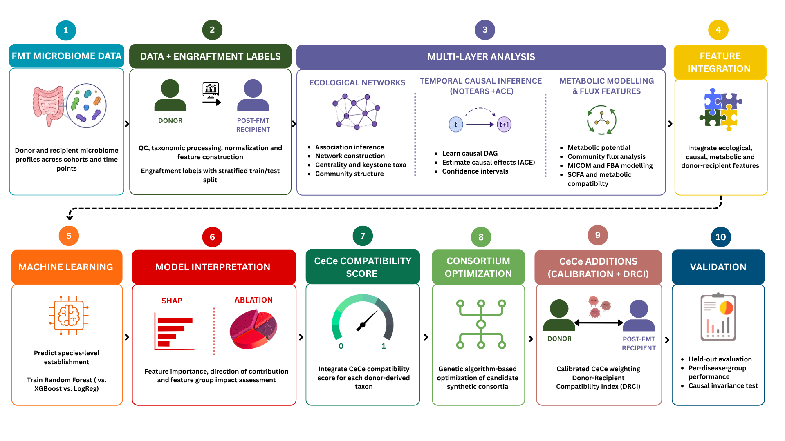

<h1 align="center"><strong>CeCe</strong></h1>

<p align="center">
  <em>
    A Multi-Layer Computational Framework for Predictive Synthetic
    Faecal Microbiota Transplantation Design
  </em>
</p>

<p align="center">
  <sub>
    Integrating Causal Inference, Ecological Network Analysis,
    Constraint-based Metabolic Modelling and Machine Learning
  </sub>
</p>

<p align="center">
  <sub>
    Undergraduate Dissertation Project · B.Sc. (Hons with Research) Microbiology · 2026
  </sub>
</p>


## 1. About

Fecal microbiota transplantation (FMT) can transfer hundreds of microbial species from a donor into a recipient, yet successful microbial establishment is not determined by donor composition alone. A species that is abundant in a donor may still fail to establish if its ecological relationships, metabolic requirements or interactions with the recipient microbiome are unfavourable.

*CeCe* explores a recipient-aware approach to this problem.

Rather than asking simply:

> Which microbes does the donor contain?

the framework asks:

> *Which donor-derived microbes are most compatible with the recipient environment and can those microbes be assembled into a coherent synthetic consortium?*

## 2. Conceptual Framework

The CeCe workflow integrates multiple biological layers:

<p align="center">
  
</p>


## 3. Results at a Glance

| Metric | Value |
|---|---|
| Classifier performance (Primary) | AUC-ROC 0.7773 (95% CI 0.759–0.797) 
| Composite score validity | Spearman ρ=0.619, p<0.0001 (n=138 species) 
| Cross-indication AUC range | 0.67 (MDR) – 0.84 (ICI)
| Dominant predictor | Donor abundance (Δ=-0.021 AUC on removal)
| Causal-effect significance | 0/131 species survive Bonferroni correction
| Causal-feature cross-indication invariance | Weak but sign-consistent (mean r=+0.070) across all 5 indications
| Ecological-compatibility GA test | Improves compatibility score (p=0.0395); pair-count improvement not significant (p=0.0552)


## 4. Methodology

Five integrated layers - **full parameters, thresholds, data sources, the complete notebooks breakdown and every result in detail present in [`PIPELINE.md`](PIPELINE.md)**


## 5. Getting Started

**Computational environment:** this project mixes local Jupyter/conda work and Google Colab, authored in VS Code with the Jupyter extension. Any standard Jupyter interface works for the non-Colab notebooks; the `_COLAB` notebooks are built to install their own system dependencies inline, in a fresh Colab runtime.
 
```bash
git clone https://github.com/rachybio/cece-fmt.git
cd cece-fmt
 
# conda environment
conda create -n cece-main python=3.10
conda activate cece-main
pip install -r requirements.txt
```
 
Notebooks `04a`, `04b`, `06`, and `08` are written for **Google Colab** (they compile FastSpar from source / need Colab's compute for MICOM and NOTEARS) — upload them to Colab and mount Google Drive as directed in each notebook's first cell. Everything else runs locally with the environment above.
 
Each of those Colab notebooks installs its own system-level dependencies automatically, in its own first cells — for reference:
 
```bash
# inside 04a / 04b — compiling FastSpar from source
apt-get install -y libgsl-dev build-essential
git clone https://github.com/scwatts/fastspar.git
cd fastspar && ./autogen.sh && ./configure && make -j4
 
# inside 08 — MICOM's GLPK solver
apt-get install -y glpk-utils libglpk-dev
```
 
**Run order:** `01` then `02` must run first — everything else depends on their outputs. After that, three branches are independent of each other and can run in any order (or in parallel):
 
- **Ecological:** `03a/03b → 04a/04b → 05`
- **Causal:** `06 → 07`
- **Metabolic:** `08`
  
  All three feed into `09`, followed by `09 → 10 → 11 → 12` in sequence.


## 6. Limitations

- The CD vs. UC AUC gap (0.778 vs. 0.675) is real and not fully explained. Feature coverage, dominant-feature signal and disease-group identity were all tested as explanations and ruled out or only partially adopted (documented in NB12).
- The causal layer (DAG + ACE) is HMP2-native only. Podlesny's FMT samples are cross-sectional, not a genuine longitudinal series, so they aren't suitable for NOTEARS, causal effects for rCDI/MetS/MDR/ICI fall back to the nearest available HMP2 estimate rather than being disease-native.
- Causal-effect estimates showed only weak sign-consistency across the 5 disease indications (mean r=+0.070). That's a further, independent reason to treat any single indication's causal estimates cautiously, even setting the HMP2-only scope issue aside, the effects that are estimated don't transfer especially cleanly across disease contexts.
- FastSpar network edges use an uncorrected bootstrap *p*-value threshold (standard in this literature for exploratory network construction, but not FDR-corrected, unlike the ACE estimation in NB07, which is).
- Some UC-specific causal effect estimates rest on small per-species samples (several below n=20); their bootstrap CIs are wide and are reported as such.
- Everything here ran on a personal laptop, with Google Colab used only for the four genuinely compute-heavy stages (FastSpar bootstrapping, NOTEARS structure learning, MICOM's flux balance simulations).

## 7. Disclaimer

None of the individual methods here are novel: SparCC, NOTEARS, MICOM, Random Forests and genetic algorithms are all established tools, each already used elsewhere in microbiome research. What CeCe tests is whether integrating them into a single scoring-and-design framework adds real value over any one method alone.
 
The closest published work I could find is Ianiro et al. (*Nature Medicine*, 2022), whose cross-dataset ML model predicted post-FMT species engraftment across eight disease types at ~0.77 AUROC, essentially the same accuracy this project's Random Forest achieves (0.777). A more recent system, MOZAIC (*Cell Reports*, 2026), uses a neural network to predict whole-donor-to-recipient compatibility. CeCe does not out-predict either of these on accuracy and doesn't claim to. What neither does is move past prediction into design: both estimate whether a species or a donor will work, not which specific subset of species should be assembled into a defined consortium. Separately, a 2022 *Lancet Microbe* Personal View explicitly called for causal-discovery methods like the DAG-based approach used here to be tested on real microbiome data rather than only simulated data, as far as this project's own literature search found, that call remains largely unanswered for FMT engraftment specifically.
 
CeCe feeds causal-effect estimates, ecological network position and metabolic-modelling features into a single classifier, then uses that classifier's predicted probability to drive an optimization step (the genetic algorithm), with a separate variant adding an explicit ecological-compatibility term on top and tests whether any of that chaining changes anything. The one concrete result on that question is the ecological-compatibility GA extension (p=0.0395 on continuous compatibility score, paired Wilcoxon signed-rank test): adding that term measurably shifted the algorithm's selected consortia toward more compatible species pairings, though the corresponding rise in mutualistic pair count (7.50 → 9.95 pairs) falls just short of significance (p=0.0552). That's a small, specific, honestly-reported piece of evidence that the integration does something beyond what prediction alone would give (not proof the whole framework works and not a claim that any of its individual parts are new).
 
It is a computational dissertation project: an exploratory, hypothesis-generating pipeline, not a validated clinical or diagnostic tool. 

## Author

**Rachna**, B.Sc. (Hons. with Research) Microbiology, Amity Institute of Microbial Technology, Amity University, Noida, Uttar Pradesh, India
[rachnasehrawatt@gmail.com]

Supervised by: 
Dr. Bhawna Rathi (Assistant Professor-II, Amity Institute of Biotechnology, Amity University, Noida, Uttar Pradesh, India),
Dr. Arti Goel (Assistant Professor-III, Amity Institute of Microbial Technology, Amity University, Noida, Uttar Pradesh, India),
Dr. Devendra Kumar Choudhary (Professor, Amity Institute of Organic Agriculture, Amity University, Noida, Uttar Pradesh, India)


---

<p align="center"><em>Built on a laptop, not a cluster</em></p>
